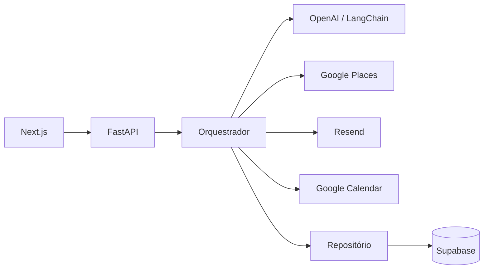

<div align="center">
  
  <h1>ServeAI</h1>
  <p><strong>Peça uma vez. O ServeAI cuida do resto.</strong></p>
  <p>Um agente de IA para encontrar, comparar e agendar serviços locais.</p>
</div>

## Sobre o projeto

O ServeAI transforma a contratação de serviços locais em uma conversa. Em vez de pesquisar vários profissionais, repetir o problema e comparar respostas manualmente, o usuário informa o que precisa, sua região, orçamento e disponibilidade. A aplicação organiza esses requisitos e conduz o fluxo de descoberta, contato, avaliação e agendamento.

O caso principal da versão atual é a contratação de um chaveiro, mas a arquitetura foi desenhada para atender outras categorias, como encanadores, eletricistas e técnicos.

### Funcionalidades

- landing page responsiva com animações;
- coleta guiada de local, problema, orçamento e disponibilidade;
- localização pelo navegador e geocodificação reversa com OpenStreetMap;
- entrada por voz com transcrição da OpenAI;
- painel com solicitações, agenda e histórico;
- API para conversas com respostas idempotentes;
- descoberta de prestadores pelo Google Places;
- contato e recebimento de propostas pelo Resend;
- criação de compromissos no Google Calendar;
- persistência em memória para desenvolvimento ou no Supabase para produção;
- adaptadores determinísticos para executar o backend sem serviços externos.

> [!NOTE]
> Atualmente, a experiência em `frontend/` é um protótipo funcional com dados e etapas simulados no cliente. O backend em `backend/` funciona de forma independente e já implementa o fluxo de conversas e integrações, mas ainda não está conectado à interface.

## Tecnologias

| Camada | Tecnologias |
| --- | --- |
| Frontend | Next.js 16, React 19, TypeScript, Tailwind CSS 4, GSAP e Lenis |
| Backend | Python 3.12+, FastAPI, Pydantic, LangChain e Uvicorn |
| Dados | Supabase/PostgreSQL ou repositório em memória |
| Integrações | OpenAI, Google Places, Resend, Google Calendar e OpenStreetMap |
| Testes | Vitest, Pytest, Ruff e mypy |
| Pacotes | pnpm e uv |

## Arquitetura



O backend segue uma arquitetura em camadas. O domínio contém a máquina de estados e as regras de avaliação; a camada de aplicação coordena o fluxo; e as integrações ficam atrás de portas substituíveis. Assim, o mesmo caso de uso pode rodar com adaptadores reais ou de demonstração.

Mais detalhes estão em [backend/docs/architecture.md](backend/docs/architecture.md).

## Estrutura do repositório

```text
.
├── frontend/                 # Landing page e aplicação Next.js
│   ├── app/                  # Páginas e rotas de servidor
│   ├── components/           # Interface do site e do agente
│   └── lib/                  # Fluxo, voz, localização e calendário
├── backend/                  # API FastAPI
│   ├── app/
│   │   ├── api/              # Rotas e schemas HTTP
│   │   ├── application/      # Orquestração e portas
│   │   ├── domain/           # Modelos e regras de negócio
│   │   └── infrastructure/   # Integrações e persistência
│   ├── supabase/migrations/  # Schema do banco de dados
│   └── tests/                # Testes do backend
├── PRD.md                    # Visão e requisitos do produto
└── Design(1).md              # Direção visual
```

## Executando localmente

### Pré-requisitos

- Node.js 20 ou superior;
- pnpm 10;
- Python 3.12 ou 3.13;
- [uv](https://docs.astral.sh/uv/).

### Frontend

```bash
cd frontend
pnpm install
cp .env.example .env.local
pnpm dev
```

Acesse [http://localhost:3000](http://localhost:3000). A landing page fica em `/` e a experiência do agente em `/app`.

A chave da OpenAI em `.env.local` é necessária somente para transcrição por voz. Sem ela, o restante da interface continua disponível.

```dotenv
OPENAI_API_KEY=sk-proj-...
OPENAI_TRANSCRIPTION_MODEL=gpt-4o-mini-transcribe
```

O navegador precisa de permissão para usar o microfone e a localização. A resolução do nome da localização consulta o Nominatim/OpenStreetMap e, portanto, requer acesso à internet.

### Backend em modo demo

O modo abaixo usa memória e adaptadores locais, sem exigir credenciais externas:

```bash
cd backend
uv sync
DEMO_AUTO_REPLY=true uv run uvicorn app.main:app --reload --port 8000
```

A API estará disponível em [http://localhost:8000](http://localhost:8000), com documentação interativa em [http://localhost:8000/docs](http://localhost:8000/docs) e diagnóstico dos adaptadores em [http://localhost:8000/health](http://localhost:8000/health).

Para criar uma conversa:

```bash
curl -X POST http://localhost:8000/api/v1/conversations \
  -H 'Content-Type: application/json' \
  -d '{
    "message": "Preciso de um chaveiro hoje entre 14h e 18h. Perdi a chave e posso gastar até R$ 200.",
    "clientMessageId": "exemplo-001",
    "location": {
      "address": "Rua dos Pinheiros, 100",
      "neighborhood": "Pinheiros",
      "city": "São Paulo",
      "latitude": -23.5666,
      "longitude": -46.6939
    }
  }'
```

O `clientMessageId` deve ser único por envio e reutilizado caso a mesma requisição precise ser repetida.

## Configuração do backend

As variáveis podem ser salvas em `backend/.env` ou `backend/.env.local`. Em desenvolvimento, todas as integrações são opcionais e possuem um adaptador de demonstração.

### Configuração principal

| Variável | Padrão | Descrição |
| --- | --- | --- |
| `APP_ENV` | `development` | Ambiente: `development`, `test` ou `production` |
| `API_PREFIX` | `/api/v1` | Prefixo das rotas da aplicação |
| `TIMEZONE` | `America/Sao_Paulo` | Fuso usado nas disponibilidades e reservas |
| `FRONTEND_ORIGINS` | localhost | Origens CORS, separadas por vírgula ou em JSON |
| `REPOSITORY_BACKEND` | `auto` | `auto`, `memory` ou `supabase` |
| `DEMO_AUTO_REPLY` | `false` | Simula uma resposta do prestador no modo demo |
| `DEMO_AUTO_REPLY_DELAY_SECONDS` | `2` | Atraso da resposta simulada |

### Integrações reais

| Integração | Variáveis necessárias |
| --- | --- |
| Supabase | `SUPABASE_URL`, `SUPABASE_SECRET_KEY` |
| OpenAI | `OPENAI_API_KEY`, opcionalmente `OPENAI_MODEL` |
| Vercel AI Gateway | `AI_GATEWAY_ENABLED`, `AI_GATEWAY_API_KEY` ou `VERCEL_OIDC_TOKEN`, `AI_GATEWAY_MODEL` |
| Google Places | `GOOGLE_PLACES_API_KEY` |
| Resend | `RESEND_API_KEY`, `RESEND_WEBHOOK_SECRET`, `RESEND_INBOUND_DOMAIN`, opcionalmente `RESEND_FROM_EMAIL` |
| Google Calendar | `GOOGLE_CLIENT_ID`, `GOOGLE_CLIENT_SECRET`, `GOOGLE_REFRESH_TOKEN`, `GOOGLE_CALENDAR_ID` |

Para o banco persistente, aplique [backend/supabase/migrations/0001_initial_schema.sql](backend/supabase/migrations/0001_initial_schema.sql) no projeto Supabase e configure `REPOSITORY_BACKEND=supabase`.

Em produção, o backend exige Supabase e todas as integrações reais. `DEMO_AUTO_REPLY`, repositório em memória e CORS aberto são bloqueados pelas validações de configuração. A exceção é uma implantação explicitamente marcada com `DEMO_DEPLOYMENT=true`, destinada apenas à demonstração pública.

## API

| Método | Rota | Descrição |
| --- | --- | --- |
| `GET` | `/health` | Informa o ambiente e o modo de cada adaptador |
| `POST` | `/api/v1/conversations` | Cria uma conversa |
| `GET` | `/api/v1/conversations/{id}` | Retorna o snapshot e a timeline da conversa |
| `POST` | `/api/v1/conversations/{id}/messages` | Adiciona uma mensagem do usuário |
| `POST` | `/api/v1/webhooks/resend` | Recebe respostas assinadas do Resend |

Os payloads públicos usam `camelCase`. O retorno de uma conversa inclui o estado atual, a timeline completa, os requisitos estruturados, a indicação `canSendMessage` e o intervalo recomendado de polling.

## Qualidade e testes

Frontend:

```bash
cd frontend
pnpm test
pnpm typecheck
pnpm build
```

Backend:

```bash
cd backend
uv run pytest
uv run ruff check .
uv run mypy app
```

## Fluxo principal

1. O usuário descreve o serviço desejado.
2. O ServeAI coleta somente os requisitos que faltam.
3. Prestadores próximos são encontrados e contatados.
4. As respostas são comparadas com orçamento e disponibilidade.
5. Uma proposta compatível é aceita.
6. O compromisso é criado e apresentado ao usuário.

Para conhecer a visão completa do produto, consulte o [PRD](PRD.md).
