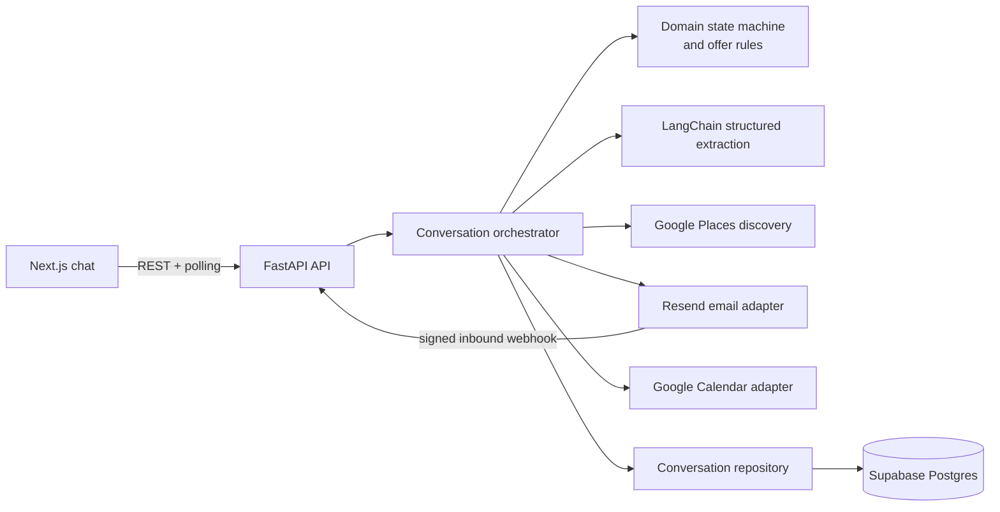
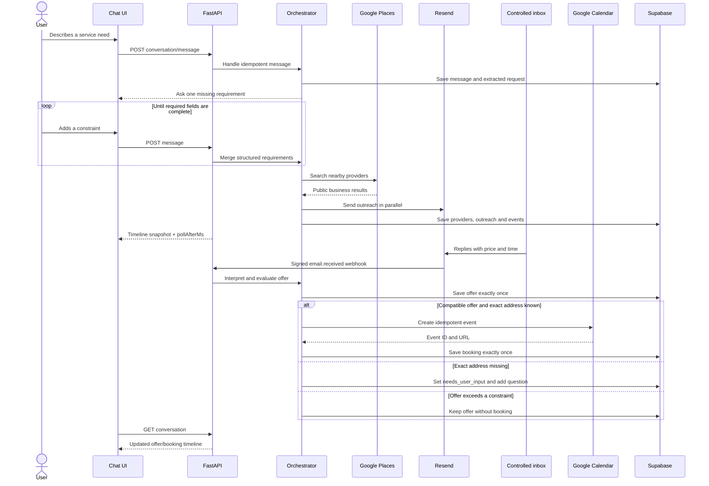
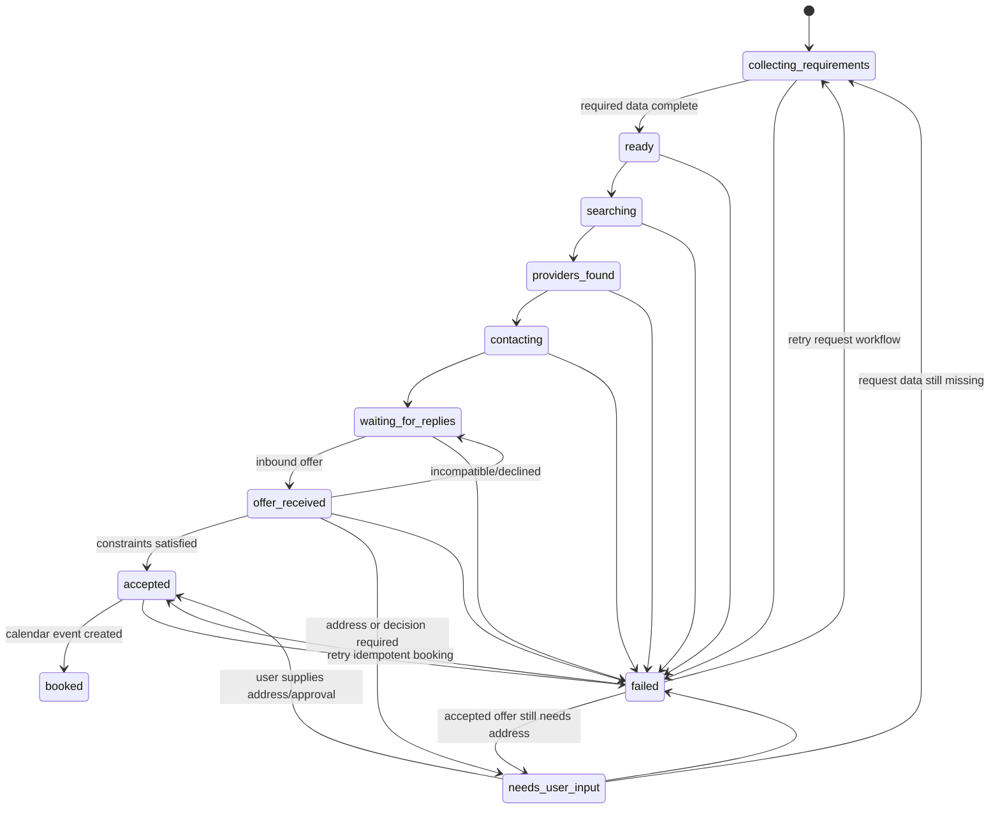
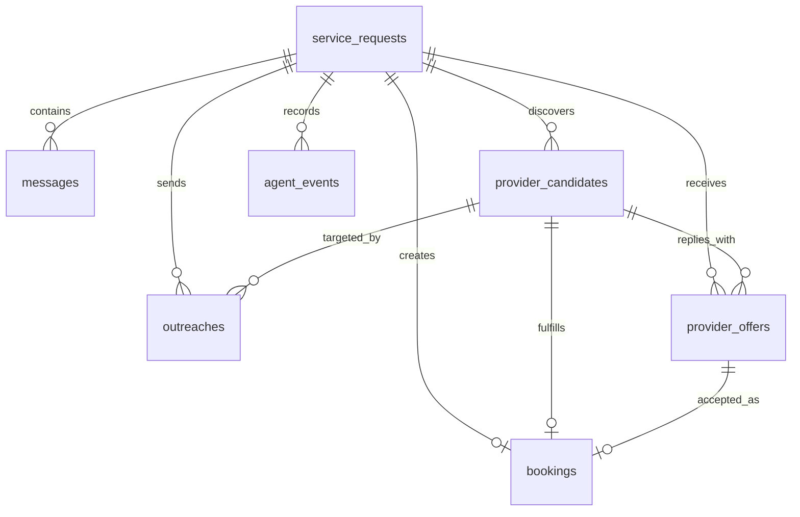

# ServeAI Backend Architecture

## Design goals

The backend serves a single chat interface while coordinating asynchronous, real-world
work. The HTTP layer remains thin; deterministic application and domain layers own
workflow decisions; integrations sit behind explicit ports. This keeps the judged code
easy to read and makes external services replaceable in tests.



Dependency direction is inward: `api` and `infrastructure` depend on application ports
and domain models, while domain code does not import FastAPI, Supabase, LangChain or a
Google SDK.

## Golden path



## State machine

The LLM never selects a status. Application code validates every transition.



`booked` is terminal. A `failed` request can be retried explicitly and then returns to
requirement collection without losing prior fields. While waiting for an external reply,
`canSendMessage` is false and `pollAfterMs` is normally `2000`. When user input is
required, `canSendMessage` becomes true and polling stops.

## Frontend timeline contract

All public JSON uses camelCase. A conversation response is a complete snapshot:

```ts
type RequestStatus =
  | "collecting_requirements"
  | "ready"
  | "searching"
  | "providers_found"
  | "contacting"
  | "waiting_for_replies"
  | "offer_received"
  | "needs_user_input"
  | "accepted"
  | "booked"
  | "failed";

type TimelineItem =
  | TextMessage
  | OperationCard
  | ProvidersCard
  | OfferCard
  | BookingCard
  | ErrorCard;

interface ChatConversation {
  conversationId: string;
  status: RequestStatus;
  canSendMessage: boolean;
  pollAfterMs: number | null;
  timeline: TimelineItem[];
  serviceRequest: ServiceRequest;
  updatedAt: string;
}
```

Every timeline item has `id`, a discriminator `type`, and `createdAt`. The variants add:

| `type` | Data rendered by the chat |
| --- | --- |
| `message` | `role` and `content` for a user/assistant bubble. |
| `operation` | Current `status`, `title` and optional `detail`. |
| `providers` | A `providers` array with name, address, rating and public contact metadata. |
| `offer` | Provider, price, proposed time and budget/availability compatibility. |
| `booking` | Provider, start/end, price, address and optional calendar event URL. |
| `error` | Safe `code`, user-facing `message` and `retryable` flag. |

The frontend must preserve API order, use `item.id` as the React key and replace its
local snapshot after each successful response. It must not infer workflow state from
text. `clientMessageId` is generated once per composer submission and reused on network
retry; the server returns the existing conversation instead of duplicating the message.

## Persistence and idempotency

The aggregate is persisted across seven tables. Messages and agent events share a
monotonic per-conversation sequence, which produces a stable merged timeline. Database
constraints guard global client-message retries, inbound email replay and duplicate
calendar bookings.



The database is not a public frontend API. RLS is enabled without client policies;
`anon` and `authenticated` have no table privileges. Only the backend's Supabase
`service_role` accesses these records.

## Failure and privacy boundaries

- External calls use bounded timeouts and safe retries; idempotency is checked before
  repeating an email, offer insert or booking.
- Every Resend outreach carries a stable provider/conversation idempotency key, so a
  network retry cannot send the same request twice within Resend's protection window.
- Webhook processing starts by validating the Svix signature over the raw request body.
- Unknown or replayed inbound IDs do not create another offer.
- Logs carry correlation IDs and state transitions, never API keys or full credentials.
- Discovery outreach contains an approximate region, not the residential address.
- The demo contact override routes messages to a controlled inbox and is explicit in
  the operational timeline/documentation.
- Vercel preview and production runtimes require Supabase; process-local memory is
  accepted only for local development and tests.
